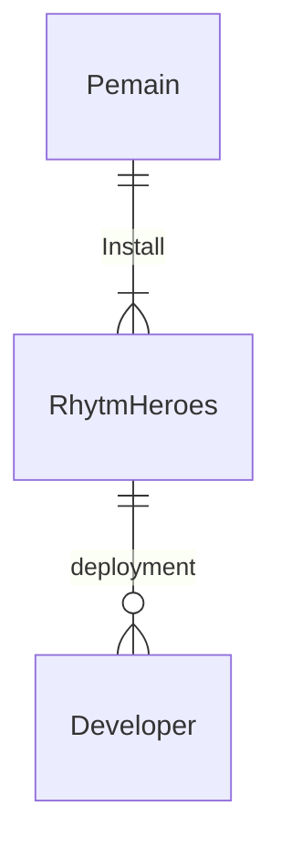

## 1.1 Latar Belakang

Dalam perkembangan dunia game yang sangat cepat ini,dilihat dari tren-tren game yang menjadi acuan untuk developer lain dalam mengembangkan gamenya, saya berfikir bahwa game unik dan menyatukan beberapa genre adalah salah satu hal yang dipakai dalam beberapa tren kebelakangan ini. Misal dalam game elden ring. Game elden ring menggabungkan 2 genre yang cukup krusial yaitu open world roam dengan genre rpg soulslike yang membuatnya meraih GOTY beberapa tahun lalu. maka dengan itu saya sebagai developer mencoba membuat game unik yang memasukan unsur turn based rpg dengan genre musik yang cukup sulit untuk di implementasikan.

## 1.2. Deksripsi Teknologi Informasi

Game yang direncanakan adalah game yang bertemakan turn base rpg dengan genre musik yang biasa dipakai dalam game arcade yang menjadikannya game unik yang mungkin belum bisa ditemukan dalam waktu dekat. Dalam proses pengembangannya, game yang direncanakan bertajuk Rhytm Hero masih dalam tahap pengembangan dan masih hanya memiliki genre musik tanpa memiliki genre rpg. Dalam game rpg dibutuhkan cerita yang apik dibarengi dengan musik bgm yang menusuk hati dan visual yang memanjakan mata membuatnya cukup sulit jika dibuat hanya dengan waktu terbatas. dalam konsepnya saya memakai konsep 8-bit agar mempermudah dalam pembuatan asset game. Dalam artikel ini perkembangan yang masih dipakai untuk referensi dari artikel hanya sebatas proses sampai mana game ini dibuat menjadikan artikel ini akan update sesuai dengan proses pembuatan game Rhytm Hero.

## 1.3. Branding

Merk : Rhytm Hero

Tagline : Power of the Voice

Campaign : Bagainama membuat game yang unik dengan mengedepankan irama

Target user:

    Usia 12+
    
    Seseorang yang menyukai game rhytm
    
    Seseorang yang menyukai game rpg
    
    Seseorang yang menikmati lagu
    
    Seseorang yang menyukai tantangan 
    
User Experience Theme : 

    Mudah
    
    Sederhana
    
    Fantasi

Inspirasi Desain :


## 2. User Story

Sebagai | Saya Ingin Bisa | Sehingga | Prioritas
---|---|---|---
Pengguna | Bisa Menekan Lantai Seirama | Mendapat Kepuasan | ⭐⭐⭐⭐⭐
Pengguna | Bisa Memainkan Lagu Yang Bermacam-Macam | Tidak Bosan | ⭐⭐⭐⭐⭐
Pengguna | Interaksi Mulus | Tidak Menghambat experience dalam bermain | ⭐⭐⭐⭐⭐

## 3. Struktur Data

Cara membuat aneka macam bentuk grafik menggunakan mermaid.js bisa lihat di [https://mermaid.js.org/syntax/entityRelationshipDiagram.html](https://mermaid.js.org/syntax/entityRelationshipDiagram.html) 



## 4. Arsitektur Sistem
```mermaid
flowchart BT 
  subgraph Server
    B[AppStore : itch.io] <--> C[Maintenance : VSCode] 
    C <--> D[Developer] 
  end
  A[Windows Execute: Unity - C#] <--> B 
  ```
## 5. Teknologi, Library, dan Framework

Dalam pembuatan game berbasis 2d ini saya menggunakan teknologi engine Unity dengan library yang masih disediakan oleh unity engine sendiri dengan framework memakai Unity Test Framework(UTF)

## 6. Desain User Experience dan User Interface


## 7. Demonstrasi Video

Link youtube nya

## 8. Bagaimana mesin komputasi dan sistem operasi berperan dalam produk teknologi informasimu ?

Link youtube nya di detik jawaban ini

## 9. Bagaimana algoritma, struktur data, dan bahasa pemrograman berperan dalam produk teknologi informasimu ?

Link youtube nya di detik jawaban ini

## 10. Bagaimana metode pengembangan perangkat lunak / Software Development Life Cycle berperan dalam produk teknologi informasimu ?

Link youtube nya di detik jawaban ini

## 11. Bagaimana database / sistem basis data berperan dalam produk teknologi informasimu ?

Link youtube nya di detik jawaban ini
