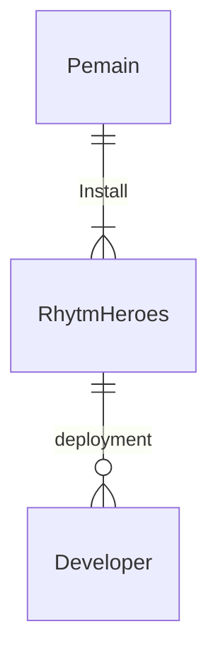

## 1.1 Latar Belakang

Dalam perkembangan dunia game yang sangat cepat ini,dilihat dari tren-tren game yang menjadi acuan untuk developer lain dalam mengembangkan gamenya, saya berfikir bahwa game unik dan menyatukan beberapa genre adalah salah satu hal yang dipakai dalam beberapa tren kebelakangan ini. Misal dalam game elden ring. Game elden ring menggabungkan 2 genre yang cukup krusial yaitu open world roam dengan genre rpg soulslike yang membuatnya meraih GOTY beberapa tahun lalu. maka dengan itu saya sebagai developer mencoba membuat game unik yang memasukan unsur turn based rpg dengan genre musik yang cukup sulit untuk di implementasikan. Dalam game genre rhytm yang pernah saya mainkan, kebanyakan game nya monoton dengan tujuan yang sangat minim yaitu hanya mencapai skor tertinggi dengan menyelesaikannya tanpa miss dengan lagu yang dibuat oleh fanbase besar yang membuatnya terus bertahan sampai saat ini. Jujur saya dalam memainkan game bergenre rhytm saya sangat menikmatinya tetapi untuk belakangan ini konten yang diberikan oleh developer game game rhytm terasa monoton dengan tujuan minim seperti sebelumnya. contohnya adalah Friday Night Funkin. Game yang dikeluarkan pada tahun 2020 ini dan sempat viral dengan banyaknya content creator yang memainkannya membuat game ini sempat viral beberapa tahun kebelakang.

Fame yang didapatkan secara mendadak itu tidak dibarengi dengan perkembangan gamenya, pada game Friday Night Funkin stage yang diberikan terbatas dan update yang dilakukan terlalu lama membuat game ini ditinggalkan karena banyak fangame yang membuat gameplay yang lebih beragam dengan menghadirkan cameo cameo yang tidak ada dalam game originalnya. untuk contoh lain seperti game osu. Game osu yang sudah cukup lama bergabung di dalam pasar game rhytm ini memiliki keunggulan yang jarang didapat dari hame rhytm lain pada masanya, dimana konsep yang diberikan oleh game ini sangat unik yaitu kita harus menekan beat yang berbentuk bulat yang bisa muncu dengan pola yang ditentukan dengan tempo yang cepat membuat adrenalin pemain yang memainkannya membara apalagi untuk penggemar game yang banyak tantangan seperti saya. Keunikan game osu ini memang membuatnya menarik ditambah dengan developernya yang membuat betmap atau lagu yang dimainkan bisa dibuat oleh fannya sendiri membuatnya tidak bosan jika dalam pemilihan lagu dengan banyaknya lagu lagu favorit darimanapun. Dalam hal ini osu sangat unggl dari segi konsep dan gameplay beserta fanbasenya tetapi untuk seseorang seperti saya yang cukup menikmati tantangan tapi cepat bosan dalam memainkan game yang monoton dengan kurangnya keinginan untuk menjadi jago atau hanya menikmati lagu dengan beats yang sangat memuaskan jika mendapat timing yang pas dengan combo yang tidak terpotong. 

Dalam pasar game RPG dibutuhkan beberapa konsep dengan beberapa aspek yang harus mencondong ke arah yang lebih baik membuat aspek aspek lainnya bisa menjadi lebih baik ataupun membuat aspek lain yang terasa  kurang terpenuhi oleh aspek yang unggul. Dalam game RPG kebanyakan aspek yang ditaru dalam segi unggul adalah aspek dalam storyline, aspek environment, aspek dialog atau interaction, lalu ada aspek musik. Aspek musik dalam game RPG memiliki peran yang sangat penting, yang bisa membuat aspek lainnya seperti aspek storyline dan environtment lebih terasa nyata atau lebih terasa bahwa kita sedang memainkan game roleplay dan sedang menjadi karakter yang kita mainkan. kebanyakan game bergenre role-play rpg yang saya tahu mereka mengedepankan aspek cerita storyline yang sangat bagus dibarengi dengan music yang memorable membuat yang bermain jika mendengarkaan music tersebut akan terasa nostalgia dengan aspek battle yang kebanyakan memakai sistem turnbased seperti Persona series, ochtopath traveler, dan lain-lain.

Pada saat saya memainkam beberapa game tersebut atau lebih tepatnya persona 5 saya berfikir "game seperti ini saya ingin buat" keingiinan itu sangat berada di otak saya untuk beberapa saat. Tetapi karna kurangnya keinginan dan kurangnya pemahaman dalam membuat game, saya hanya bisa mengimajinasikannya saja dalam bentuk pikiran yang bisa saja lupa beberapa detik setelahnya. Game yanag ingin saya buat adalah game yang mengedepankan game role-play RPG yang sanat kental dengan storyline yang sangat apik dibarengi dengan salah satu genre faforit saya yaitu rhytm game membuat saya berfikir bahwa game yang memiliki genre rpg yang saya tahu belum pernah ada yang bersama dengan gameplay battlephase rhytm game yang saya inginkan membuat rasa keinginan saya untuk membuat game cukup bertambah, ditambah dengan saat masuk perkuliahan ini, ilmu yang saya dapatkan sudah lumayan cukup untuk mengimplementasikan apa yang saya inginkan pada aplikasi unity pada saat ini.

## 1.2. Deksripsi Teknologi Informasi

Game Rhytm Hero ini bertemakan tentang seseorang yang nelayan yang tidak pandai memancing berada di dunia dimana music adalah segalanya. mencoba bertahan dalam ketidakmampuan ia menemukan suatu alat akustik yang ternyata itu adalah alat ancient yang belum pernah ditemukan. Memegang benda ancient itu ia dibisikan sesuatu yang mengenalkan dirina dengan nama aras kejadian itu dibarengi dengan getaran dan gemuruh suara yang tidak pernah terjadi selama ia hidup. ditepatkan di dunia bernama orin kita disuguhkan dengan cerita seseorang bernama Cadence yang mencoba bertahan hidup di dunia yang ia rasa bukan untuk dirinya. Ditemani dengan suara misterius dari akustik ancient yang pernah ia pegang dibarengu dengan masalah lain yang membuatnya menjadi karakter utama dari dunia yang dibentuk oleh suatu entitas ini.

game yang bertajuk Rhytm Hero ini sesuai dengan namanya ia mengedepankan game ke aspek rhytm sebagai daya tarik utamanya ditambah dengan cerita perjalanan hidup dari cadence yang asalnya hanya ingin bertahan tetapi takdir berkata bahwa ia adalah penyelamat dunia. Dalam game ini battle phase yang disajikan akan seperti game ritme yang biasa ada di arcade dengan bumbu story line yang dipusatkan pada karakter cadence yang masih belum diketahui masa lalunya dan masa depan yang akan dia lalui. 

game ini dibuat dengan game engine Unity dan bergenre 2d turn based rpg,rhytm,pixel, indie dengan campuran komedi dan dengan cerita menarik yang akan berkembang bersamaan dengan progress dari gamenya. Semua asset yang ada dalam game ini dibuat oleh satu orang dan masih belum berpengalaman dalam ranah pixel art, lagu, soundtrack, sound effect, dubbing, gameplay,dan aspek lainnya yang membuatnya masih sangat kurang dalam beberapa bidang atau seperti masih ada yang tidak pas atau terasa kaku dari segi gameplay dan bidang lainnya.

Game yang bertajuk rhytm hero ini Dalam perencanaan perilisannya akan mengambil port android dengan berbagai update ui lain yang memudahkan para pemain dan menambah user experience dalam permainan game Rhytm Hero ini. Game ini terinspirasi dari beberapa game yang sudah terkenal di ranah dunia game seperti game Undertale yang dibuat oleh Toby Fox, lalu ada osu atau secara rincinya adalah osu mania, game Pokemon series karena dalam grafik dan segi gameplaynya juga environtment akan mengikuti style dari game pokemon black and white, lalu ada persona 5 karena dalam segi dialog game persona 5 menurut saya memiliki dialog yang sangat hidup dan melimpah dengan beberapa sistem seperti arcana atau lebih ganpangnya yaitu status ikatan (Bond) setiap karakter akan memiliki status yang akan berpengaruh pada beberapa aspek dalam game. Dalam beberapa aspek untuk memperkaya gamenya, saya akan mengambil referensi dari game Yakuza series dari Ryu Ga Gotoku atau lebih tepatnya game Yakuza 0 karena dalam game Yakuza 0 menurut saya game itu memiliki side quest side quest yang banyak dan beragam serta unik berbeda dengan game lainnya. Dalam side questnya game itu meski kadang terasa aneh ataupun kadang terasa tidak masuk akal tetapi keunikan itu yang membuatnya sangat dicintai penggemarnya termasuk saya. Dalam segi farming untuk menambah level dan memperkuat karakter saya ingin farming seperti game rhytm lainnya atau secara spesifik yaitu game Hatsune Miku Colorful Stage tetapi dengan bumbu lain dalam farmingnya tidak hanya langsung memilih lagu tetapi akan melakukan seperti approaching foe atau mirip seperti game Persona Series atau game Yakuza series maupun game pokemon hello eevee.

Dalam game Rhytm Hero kita bisa farming diantaranya pet,weapon,card,armor,ataupun gameobject lainnya untuk menambah keseruan dalam bermain yang membuat para pemain lebih mengulik equipment yang disediakan dalam game ini. Untuk software yang dipakai dalam proses pembuatan game Rhytm Hero ini beberapa diantaranya:

- Unity
  Software Unity dipakai dalam melakukan design dalam pembuatan gamenya dengan memakai asset yang sudah disiapkan.

- Pixilart
  Pixilart sebenarnya bukan software lebih ke website yang sangat saya pakai dalam pembuatan asset game.

- Visual Studio
  visual studio dipakai dalam melakukan coding backend dalam game yang sudah di design di software unity

- Apex Legend
  Apex Legend diperlukan untuk memelihara mental sanity dalam pembuatan dan penyelesaian code.


## 1.3. Branding

Merk : Rhytm Hero

Tagline : Power of the Voice

Campaign : Bagainama membuat game yang unik dengan mengedepankan irama

Target user:

    Usia 12+

    Seseorang yang senang mencoba hal-hal baru

    Seseorang yang menikmati story dalam game
    
    Seseorang yang menyukai game rhytm
    
    Seseorang yang menyukai game rpg
    
    Seseorang yang menikmati lagu
    
    Seseorang yang menyukai tantangan 
    
User Experience Theme : 

    Mudah

    Pixelated

    Story

    Music
    
    Simple

    Komedi
    
    Fantasi

Inspirasi Desain :


## 2. User Story

Sebagai | Saya Ingin Bisa | Sehingga | Prioritas
---|---|---|---
Pengguna | Bisa Menekan Lantai Seirama | Mendapat Kepuasan | ⭐⭐⭐⭐⭐
Pengguna | Bisa Memainkan Lagu Yang Bermacam-Macam | Tidak Bosan | ⭐⭐⭐⭐⭐
Pengguna | Interaksi Mulus | Tidak Menghambat experience dalam bermain | ⭐⭐⭐⭐⭐
Pengguna | Bisa mengakses game | tidak ada bug dalam proses launcher dalam game | ⭐⭐⭐⭐⭐
Pengguna | Bisa save dan load game dengan online ataupun local | dalam proses saveing game bisa memilih save ke local data atau sync lewat online cloud database | ⭐⭐⭐⭐⭐
Pengguna | Bisa membuka menu dalam game | dalam proses mainmenu bisa mengakses semua tombol yang ada ataupun mengakses quit | ⭐⭐⭐⭐⭐
Pengguna | Bisa mengedit karakter sesuai cosmetik atau equipment yang kita punya | bisa mengedit custom character agar bisa sesuai dengan keinginan pemainnya | ⭐⭐⭐⭐⭐
Pengguna |  |  | ⭐⭐⭐⭐⭐

## 3. Struktur Data

Cara membuat aneka macam bentuk grafik menggunakan mermaid.js bisa lihat di [https://mermaid.js.org/syntax/entityRelationshipDiagram.html](https://mermaid.js.org/syntax/entityRelationshipDiagram.html) 



## 4. Arsitektur Sistem
```mermaid
flowchart BT 
  subgraph Server
    B[AppStore : itch.io] <--> C[Maintenance : VSCode] 
    C <--> D[Developer] 
  end
  A[Windows Execute: Unity - C#] <--> B 
  ```
## 5. Teknologi, Library, dan Framework

Dalam pembuatan game berbasis 2d ini saya menggunakan teknologi engine Unity dengan library yang masih disediakan oleh unity engine sendiri dengan framework memakai Unity Test Framework(UTF)

## 6. Desain User Experience dan User Interface


## 7. Demonstrasi Video

Link youtube nya

## 8. Bagaimana mesin komputasi dan sistem operasi berperan dalam produk teknologi informasimu ?

Link youtube nya di detik jawaban ini

## 9. Bagaimana algoritma, struktur data, dan bahasa pemrograman berperan dalam produk teknologi informasimu ?

Link youtube nya di detik jawaban ini

## 10. Bagaimana metode pengembangan perangkat lunak / Software Development Life Cycle berperan dalam produk teknologi informasimu ?

Link youtube nya di detik jawaban ini

## 11. Bagaimana database / sistem basis data berperan dalam produk teknologi informasimu ?

Link youtube nya di detik jawaban ini
